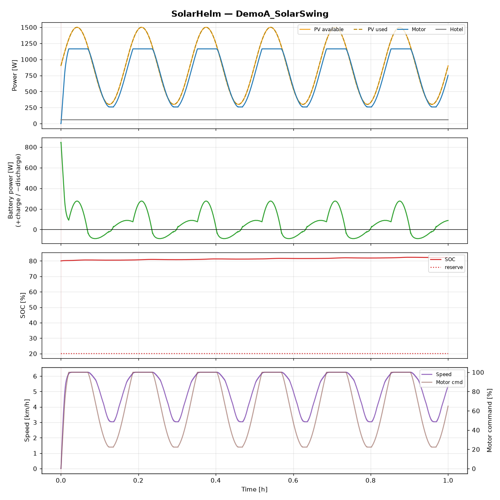
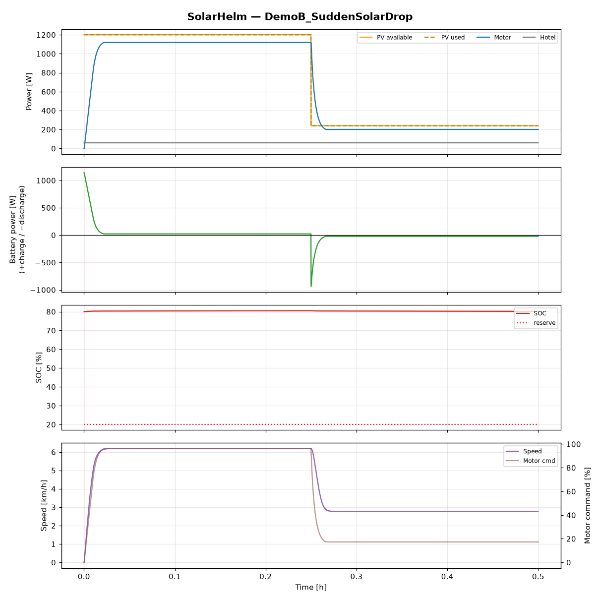
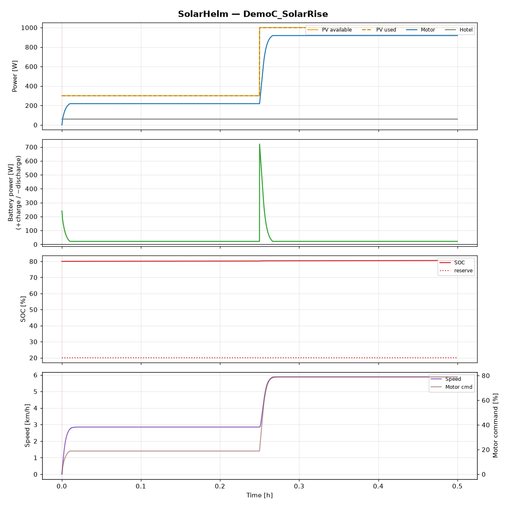
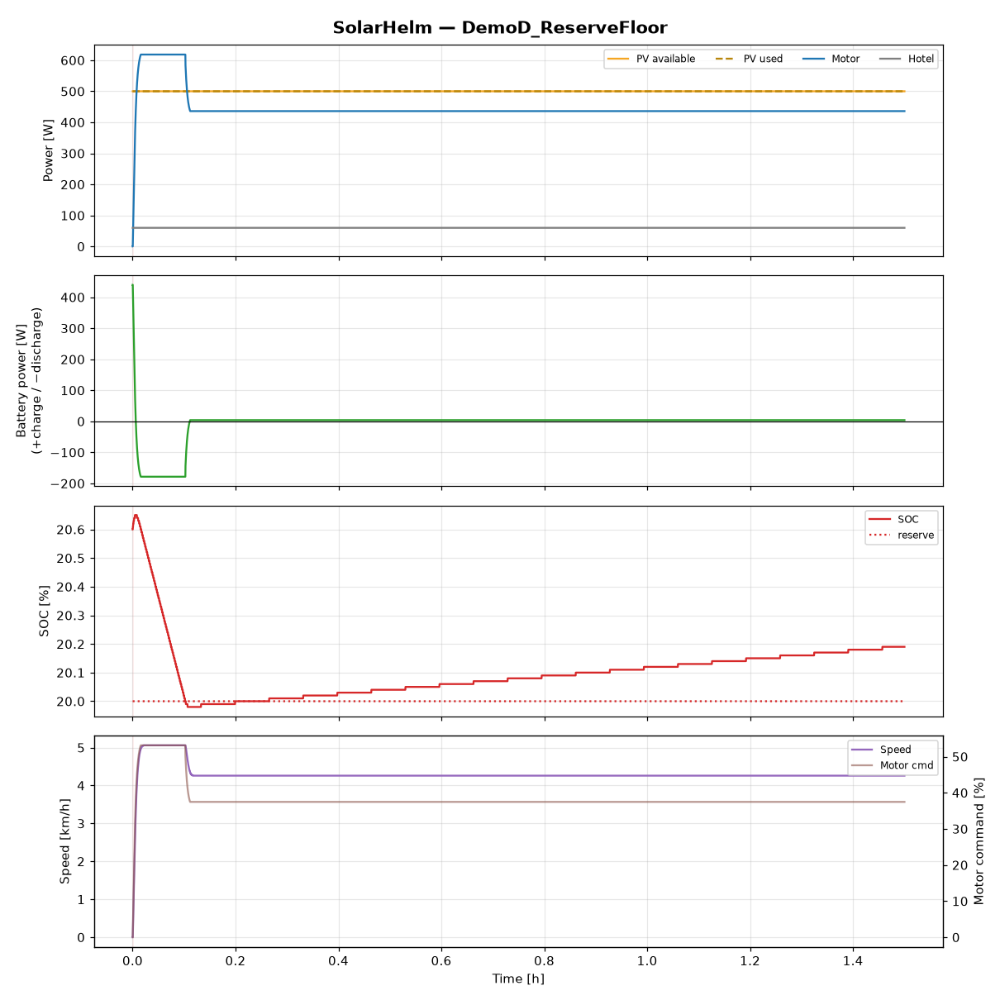
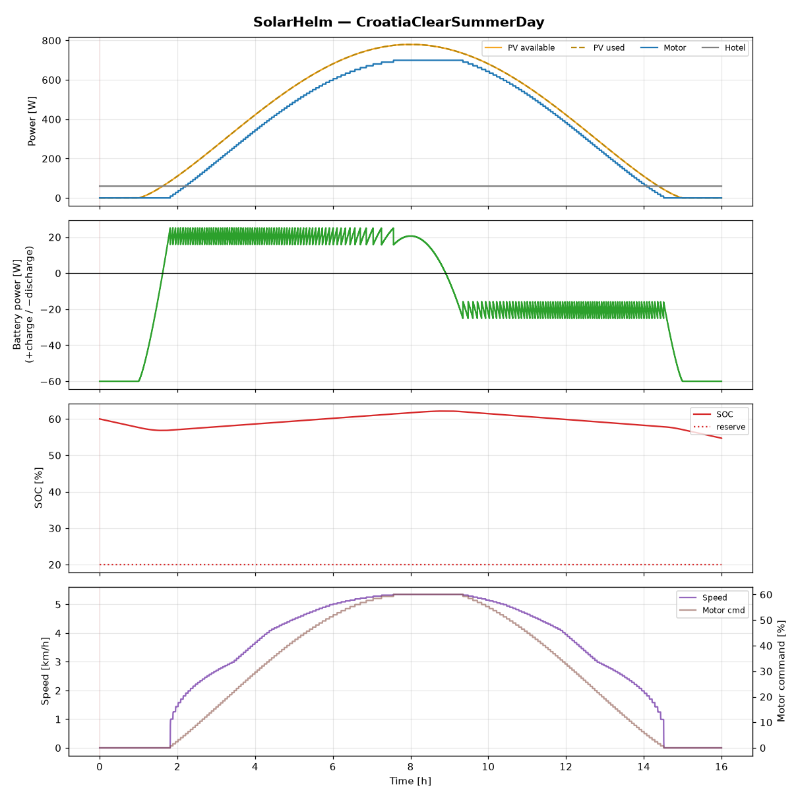
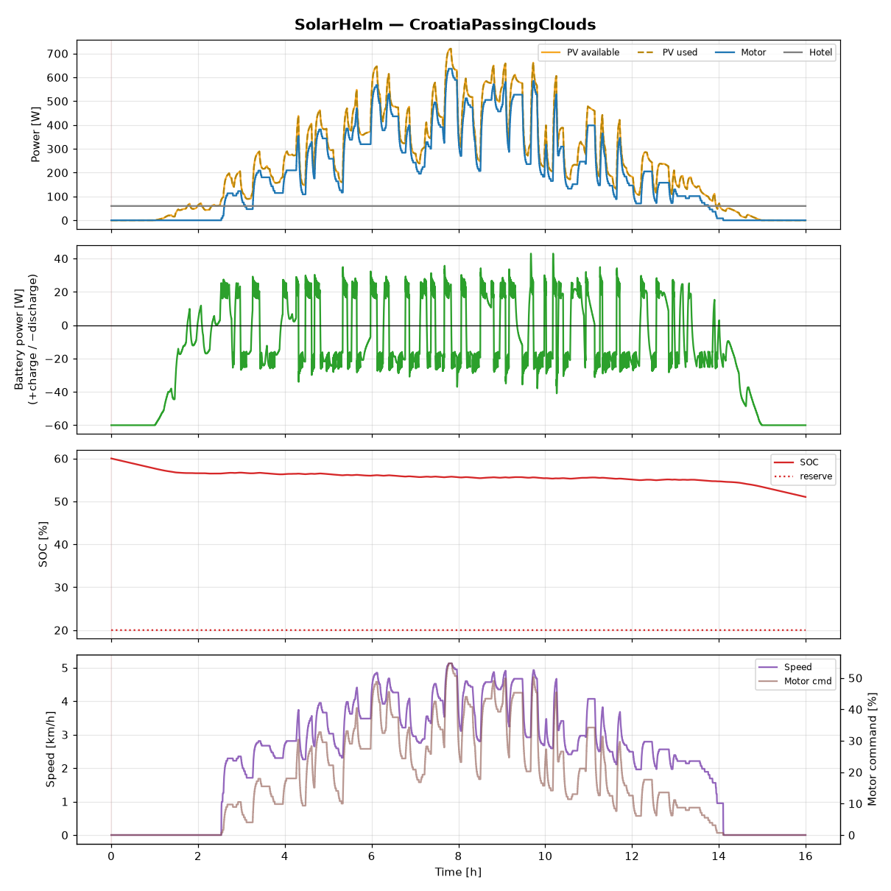
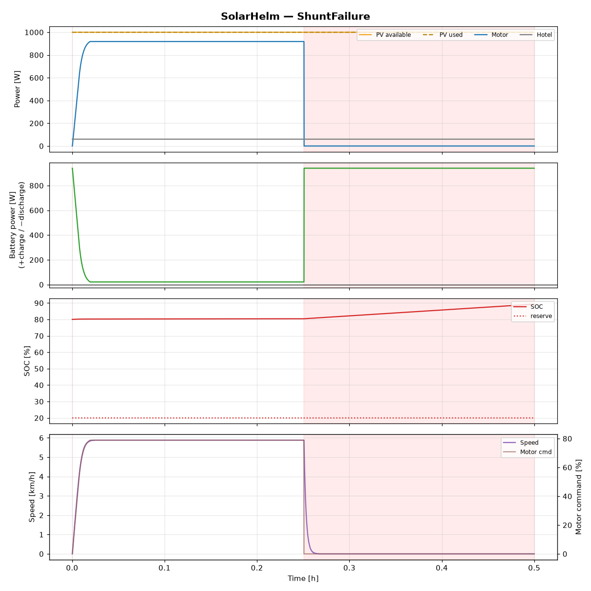

# Simulation Results — Milestone 1

Every run below uses the **unmodified production control core** (`lib/solarhelm`)
closed against the simulator models (`lib/simcore`), the default
`config/boat_profile.json` (1 kWp PV at 0.78 derating, 2.56 kWh LiFePO4,
1164 W motor, 60 W hotel load) and the default `ControlConfig`
(kp = 0.02 %/W, ki = 0.006 %/(W·s), deadband ±25 W, ramp +2/−5 %/s,
reserve SOC 20 % with 2 % hysteresis).

Reproduce everything with:

```
make scenarios                      # writes sim/out/*.csv
python3 tools/plot_scenarios.py     # renders docs/img/*.png
```

All numbers are asserted by `tests/test_simulation.cpp`, so they cannot
silently regress. Runs are bit-for-bit deterministic.

---

## Scenario A — solar swings 300–1500 W, battery power holds ≈ 0 W

`DemoA_SolarSwing`: PV oscillates sinusoidally 300→1500 W with a 10-minute
period. SOLAR mode (target battery power = 0 W).



Result (steady state, motor unsaturated):

| metric | value |
|---|---|
| mean battery power | **−1.1 W** |
| worst transient excursion | −88…+89 W |
| boat speed range | 3.0 – 6.3 km/h |

The motor "surfs" the solar wave: speed floats between 3 and 6.3 km/h while
the battery neither charges nor drains on average. When PV exceeds motor
maximum + hotel (above ~1224 W), the motor saturates at 100 % and the
surplus legitimately charges the battery — visible as the +276 W flat tops.

## Scenario B — solar collapses 80 %, motor ramps down safely

`DemoB_SuddenSolarDrop`: steady 1200 W PV; at t = 15 min PV steps to 240 W.



| metric | value |
|---|---|
| motor command before / after | 96 % → 17 % |
| command slew (never exceeded) | −5 %/s, +2 %/s |
| battery power at end | −21 W (inside deadband) |

The battery covers the deficit for the ~16 s the ramp-down takes, then the
boat settles at the new solar-only speed. Every single tick's slew is
asserted against the configured limits.

## Scenario C — solar rises fast, no overshoot

`DemoC_SolarRise`: 300 W steps to 1000 W at t = 15 min.



| metric | value |
|---|---|
| motor command peak | 78.9 % |
| motor command final | 78.9 % |
| overshoot | **0.0 %-points** |

Tracking anti-windup keeps the PI integrator seated on the rate-limited
output, so the command climbs at exactly +2 %/s and stops dead on the new
equilibrium.

## Scenario D — reserve SOC is inviolable

`DemoD_ReserveFloor`: SOLAR+ mode (target −200 W battery contribution),
starting at 20.6 % SOC with the reserve at 20 %.



| metric | value |
|---|---|
| minimum SOC | 19.98 % |
| final SOC (1.5 h later) | 20.19 % and rising |
| final battery power | +3.9 W |

SOLAR+ drains −180 W as commanded until SOC touches the reserve. The floor
latches (2 % hysteresis — no target chatter), the target becomes
+deadband, and the boat drops to the speed pure solar affords. The
worst-case dip below the reserve during the ramp transition is 0.02 %.
SolarHelm holds position at the floor; it does not abort the cruise.

## Croatia clear summer day

`CroatiaClearSummerDay`: 05:00–21:00, clear-sky arc, SOLAR mode all day.



| metric | value |
|---|---|
| solar energy harvested | 6.39 kWh |
| distance covered | **51.4 km** |
| average efficiency | 108 Wh/km |
| SOC start → end | 60 % → 54.7 % |

The battery ends within ~5 % of where it started — the deficit is exactly
the dark-hours hotel load. Solar paid for the entire day of cruising.

## Croatia with passing clouds

`CroatiaPassingClouds`: same day, deterministic random cloud walk
(transmission 0.25–1.0, redrawn every 2–10 min).



3.79 kWh harvested, 36.3 km covered. The boat visibly slows under clouds
and speeds up in gaps; no throttle oscillation.

## Fail-safe demonstrations



- **ShuntFailure** — battery monitor stops updating mid-cruise: within the
  3 s timeout SolarHelm force-transitions to MANUAL, the automatic throttle
  output goes to 0 % and stays there (red shading in the plot). Auto mode
  does **not** resume by itself when data returns.
- **GPSFailure** — cruise continues (GPS is not control-critical);
  distance/efficiency accounting pauses so the Wh/km statistics stay clean.
- **SensorFailure** (MPPT telemetry loss) — control keeps running on the
  shunt alone; PV telemetry reads 0 with a fault flag.

## Interpretation and next steps

- The PI + deadband + asymmetric-ramp structure is sufficient for the
  Milestone-1 goals; no gain scheduling was needed at this plant gain
  (~11.6 W per % command).
- The deadband (±25 W) trades a small standing error for zero hunting.
  On real hardware the shunt's 10 mA resolution would support a tighter
  deadband; tune at sea trials.
- The simulator's hull curve is the spec's placeholder table. **Real sea
  trials must replace it** (docs/SEA_TRIALS.md) before efficiency numbers
  mean anything for a specific boat.

**Next smallest useful step:** implement the VE.Direct text-protocol parser
as a pure-C++, desktop-testable module (`drivers/victron/`) so the same
Helm core can consume a real Victron SmartShunt on the bench — the first
hardware-in-loop milestone (see docs/ROADMAP.md).
